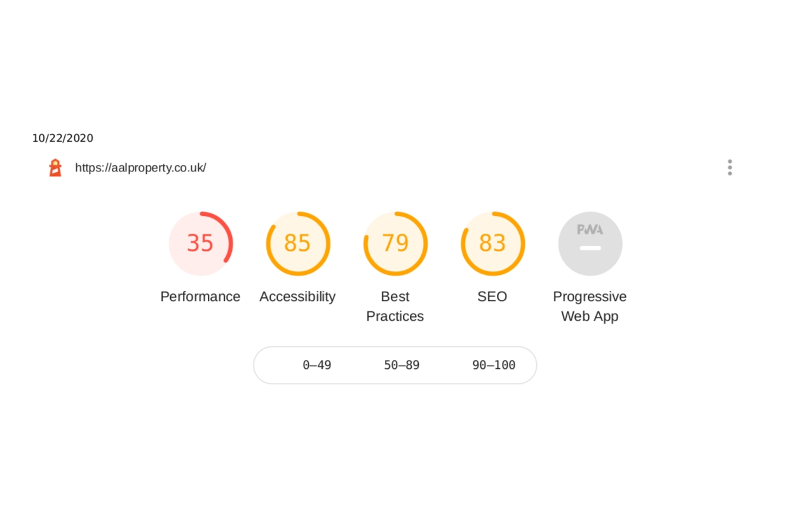
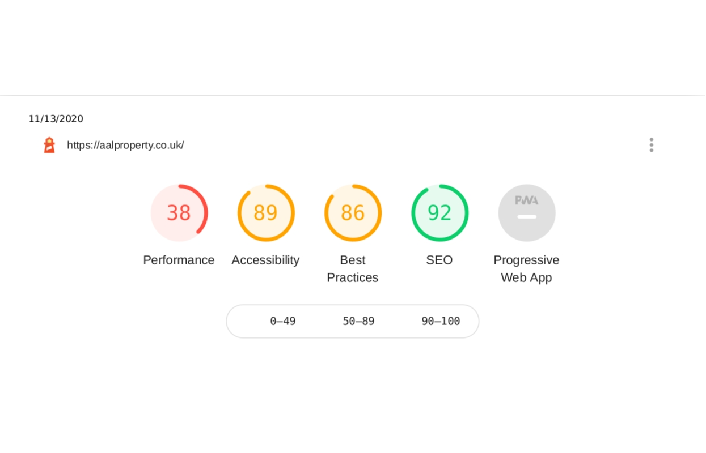

# Optimization & re-bumping of AAL Property Solution's website

> Improvement of Accessibility, Best Practices and SEO of  this WordPress website: https://aalproperty.co.uk/. Some new features were added and existing ones were improved, providing a fine grain level of customization for the client.

## Table of contents

* [General info](#general-info)
* [Screenshots](#screenshots)
* [Technologies](#technologies)
* [Jobs done to the website](#Jobs-done-to-the-website)
* [Status](#status)
* [Inspiration](#inspiration)
* [Contact](#contact)

## General info

An **optimization and re-bumping** work was done to provide _AAL Property Solutions_ a website that ranks higher on Google search, is accessible for screen readers, has the best practices and a has a polished layout and look.

The first step was to get a [LightHouse](https://developers.google.com/web/tools/lighthouse) report and check the values of Performance, Accessibility, Best Practices and SEO. After making the changes to the website suggested by [LightHouse](https://developers.google.com/web/tools/lighthouse), another report was done, and the results can be seen in the coming sections.

## Screenshots

Lighthouse report screen shot **before** the work:

Lighthouse report screen shot **after** the work:

## Technologies

*  [WordPress](https://wordpress.org/)
*  [LightHouse](https://developers.google.com/web/tools/lighthouse)

## Jobs done to the website

List of jobs done to website:

* Improve **Accessibility** from **85% to 89%** 
* Improve **Best Practices** from **79% to 86%** 
* Improve **Accessibility** from **83% to 92%** 
* Add new features to `home` page
* Add new features to `about us` page
* Add new features to `clients` pages
* Add new features to `360-virtual-property-tours` page

List of improvements that could be done:

* depends on the client's future requests

  

## Status

Project is _under periodic maintenance_.

## Inspiration

This project was done to get experience optimizing websites, and working with [WordPress](https://wordpress.org/).

## Contact

Optimization done by [Esteban Munch Jones](https://www.linkedin.com/in/estebanmunchjones/)- feel free to contact me.

